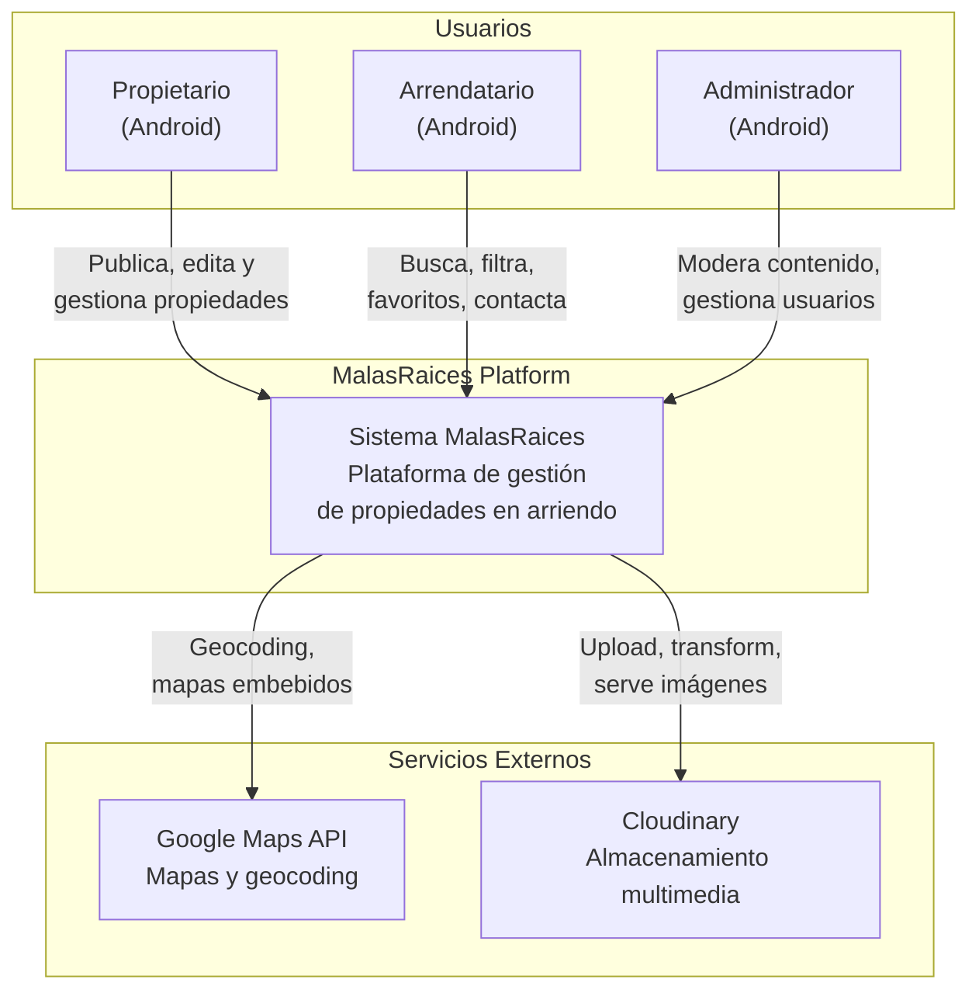
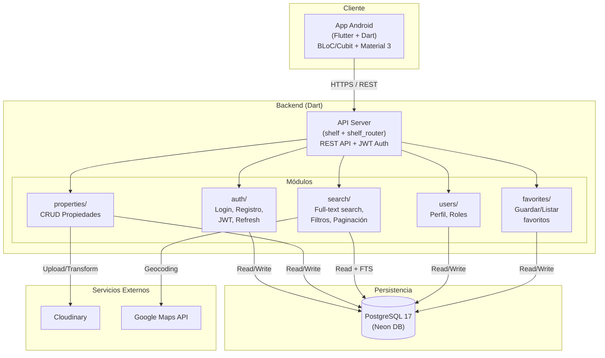
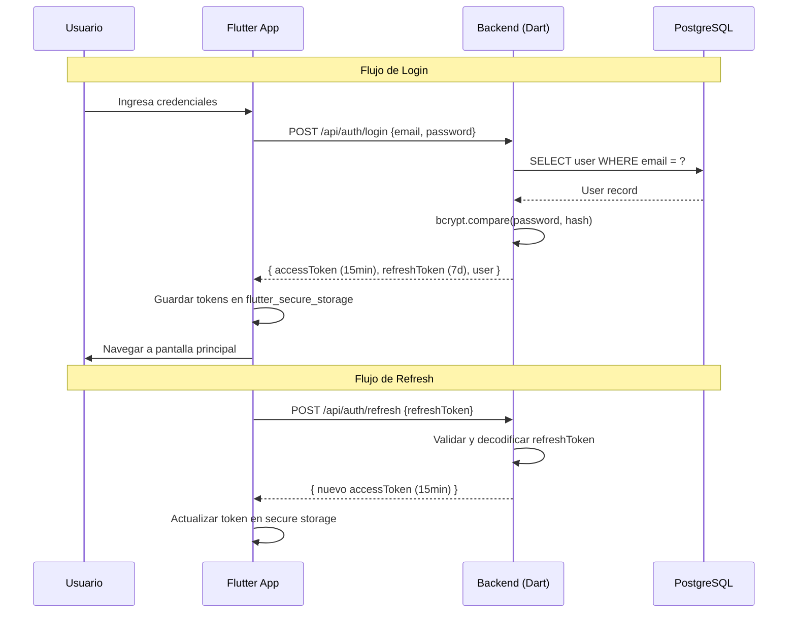
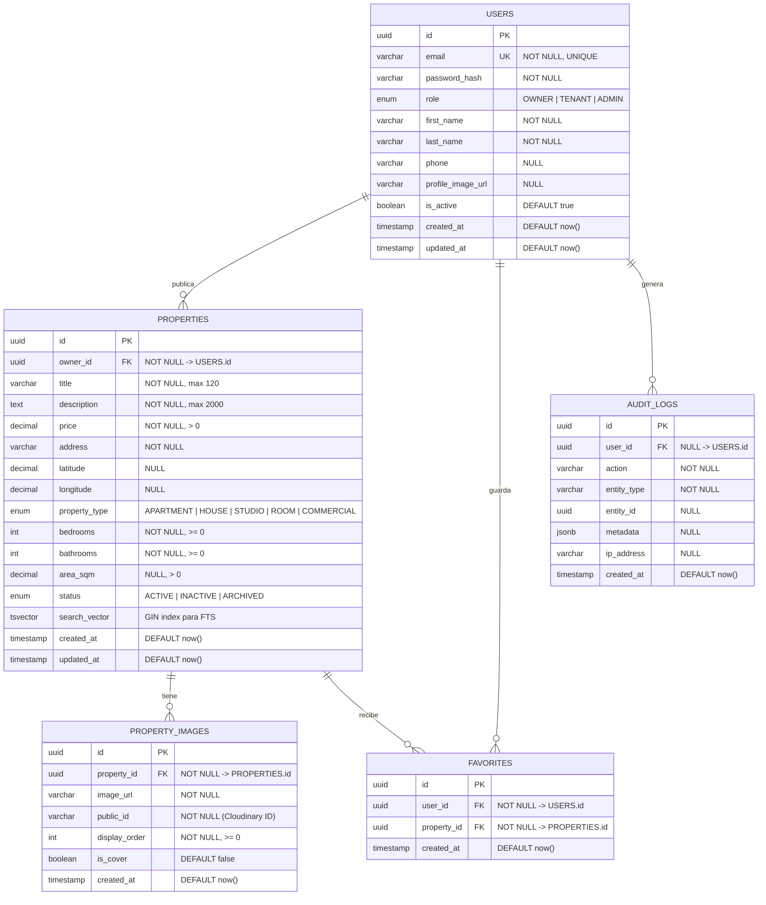
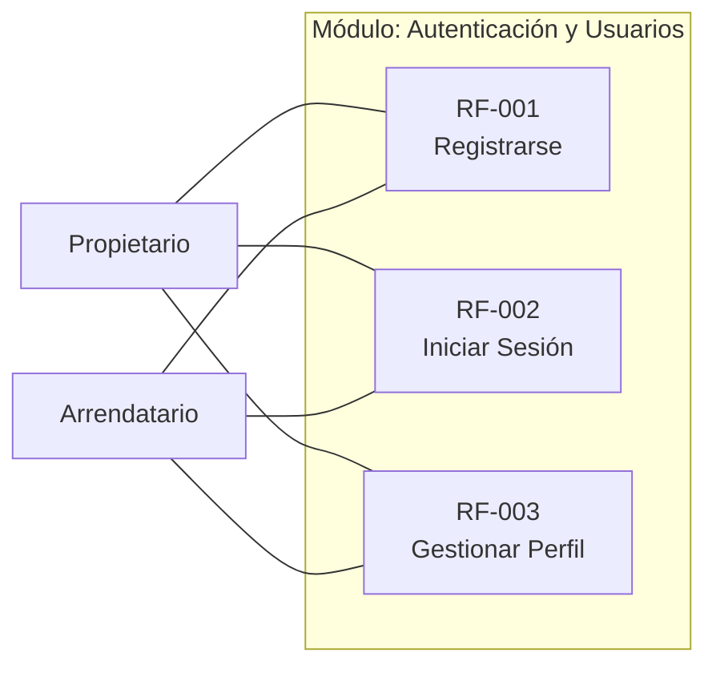
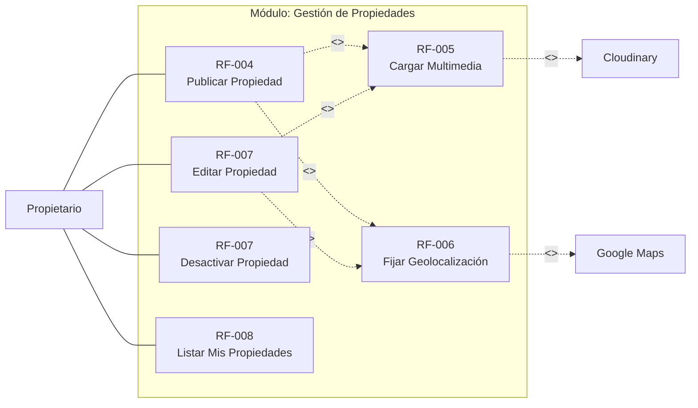
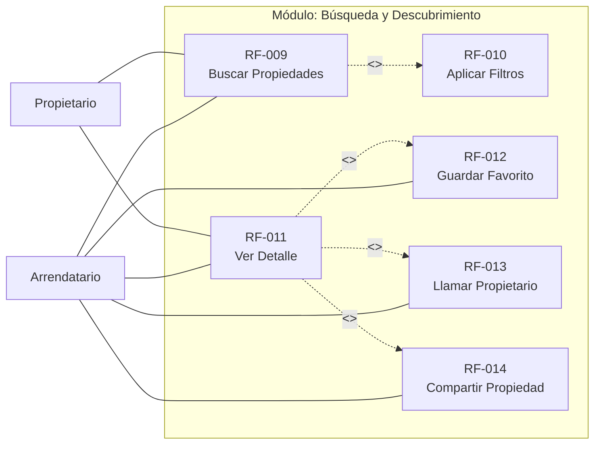

# ARQUITECTURA - MalasRaices

> Documento de Arquitectura de Software (SAD) para la plataforma de gestión de propiedades en arriendo.
>
> **Versión:** 2.0
> **Fecha:** 2026-02-27
> **Autor:** Equipo de Arquitectura MalasRaices

---

## Tabla de Contenidos

1. [Análisis Crítico de Requerimientos](#1-análisis-crítico-de-requerimientos)
2. [Requerimientos No Funcionales](#2-requerimientos-no-funcionales)
3. [Stack Tecnológico](#3-stack-tecnológico)
4. [Diagramas de Arquitectura](#4-diagramas-de-arquitectura)
5. [Modelo de Datos (Entidad-Relación)](#5-modelo-de-datos-entidad-relación)
6. [Diagramas de Casos de Uso](#6-diagramas-de-casos-de-uso)
7. [Estructura de Componentes](#7-estructura-de-componentes)
8. [Decisiones Arquitectónicas (ADRs)](#8-decisiones-arquitectónicas-adrs)
9. [Contratos de API](#9-contratos-de-api)

---

## 1. Análisis Crítico de Requerimientos

### 1.1 Errores y Ambigüedades Detectadas

| ID | Hallazgo | Severidad | Recomendación |
|---|---|---|---|
| H-01 | **RF-001 Precondición incoherente**: dice "El usuario debe tener sesión iniciada y un héroe equip". El registro NO requiere sesión previa (es un flujo para usuarios nuevos). Parece un copy-paste de otro documento. | **Alta** | Corregir a: "El usuario NO debe tener una cuenta registrada previamente en el sistema." |
| H-02 | **RF-002 Requerimiento asociado**: dice "RF-001x\|" — carácter basura al final. | Baja | Corregir a "RF-001". |
| H-03 | **RF-007 Entrada = Salida**: Entrada y Salida tienen el mismo texto ("Acción de editar campos o eliminar la propiedad"). La salida debería ser "Propiedad actualizada o marcada como inactiva". | Media | Corregir la salida para reflejar el resultado, no la acción. |
| H-04 | **RF-007 "Eliminar" vs Soft Delete**: La descripción dice "eliminar" pero la postcondición dice "estado cambia a Inactiva". Esto genera ambigüedad: ¿es un hard delete o un soft delete? | **Alta** | Definir explícitamente: usar **soft delete** (cambio de estado a `INACTIVE`). El hard delete solo debe ser posible por un administrador o por política de retención de datos. |
| H-05 | **RF-012 y RF-013 Formato de ID inconsistente**: RF-001 a RF-011 usan "RF-00X", pero RF-012 en adelante usan "RF-12". Falta el cero de padding. | Baja | Estandarizar a "RF-0XX" para consistencia. |
| H-06 | **Rol de Administrador ausente**: No existe un rol Admin para moderar contenido, gestionar usuarios o manejar reportes. | **Alta** | Agregar rol `ADMIN` con capacidades de moderación, gestión de usuarios y configuración del sistema. |

### 1.2 Gaps Funcionales Críticos

#### Seguridad

| Gap | Riesgo | Impacto |
|---|---|---|
| **No hay validación de contenido multimedia** | Inyección de malware mediante imágenes, contenido inapropiado | Alto |
| **No hay política de contraseñas** | Cuentas con contraseñas débiles como "123456" | Alto |
| **Sin rate limiting** | Ataques de fuerza bruta al login, spam de publicaciones | Alto |
| **Sin verificación de email** | Cuentas falsas, spam | Medio |
| **Sin auditoría de acciones** | Imposible rastrear quién hizo qué | Medio |

#### Escalabilidad

| Gap | Riesgo | Impacto |
|---|---|---|
| **Sin estrategia de caché** | Cada búsqueda golpea la base de datos | Alto |
| **Sin límite de propiedades por usuario** | Un usuario podría crear miles de publicaciones | Medio |
| **Sin compresión/redimensión de imágenes** | Almacenamiento costoso, carga lenta | Alto |

#### Funcional

| Gap | Descripción |
|---|---|
| **Sin sistema de notificaciones** | El propietario no se entera cuando alguien contacta o guarda su propiedad |
| **Sin flujo de recuperación de contraseña** | Usuario que olvida su clave queda bloqueado permanentemente |
| **Sin términos y condiciones / consentimiento** | Riesgo legal, incumplimiento de leyes de protección de datos |
| **Sin reportes de propiedades** | No hay mecanismo para denunciar publicaciones fraudulentas |
| **Sin ordenamiento de resultados** | Los resultados de búsqueda no tienen criterio de orden |
| **Comportamiento de favoritos huérfanos** | ¿Qué pasa cuando una propiedad favorita se desactiva? No está definido |
| **Sin mensajería interna** | La única forma de contacto es llamada telefónica |

---

## 2. Requerimientos No Funcionales

### RNF-001: Rendimiento

| Métrica | Objetivo | Medición |
|---|---|---|
| Tiempo de respuesta API | ≤ 300ms (p95) para operaciones de lectura | Logging estructurado |
| Tiempo de respuesta API | ≤ 800ms (p95) para operaciones de escritura | Logging estructurado |
| Tiempo de arranque de app | ≤ 2s cold start en conexión 4G | Firebase Performance |
| Carga de imágenes | ≤ 2s por imagen optimizada | CDN metrics |
| Búsqueda con filtros | ≤ 500ms para hasta 100K propiedades | Query profiling |

### RNF-002: Escalabilidad

| Aspecto | Objetivo |
|---|---|
| Usuarios concurrentes | Soportar al menos 1,000 usuarios simultáneos en fase inicial |
| Crecimiento de datos | Modelo de datos preparado para 500K+ propiedades |
| Escalamiento horizontal | Servidor stateless que permita múltiples instancias |
| Almacenamiento multimedia | Delegado a servicio externo (Cloudinary) |

### RNF-003: Disponibilidad

| Aspecto | Objetivo |
|---|---|
| Uptime | ≥ 99.5% (≈ 43h de downtime/año máximo) |
| RPO (Recovery Point Objective) | ≤ 1 hora |
| RTO (Recovery Time Objective) | ≤ 4 horas |
| Backups | Automatizados por Neon DB (point-in-time recovery) |

### RNF-004: Seguridad

| Aspecto | Requisito |
|---|---|
| Autenticación | JWT con refresh tokens. Tokens de acceso con TTL de 15 min |
| Contraseñas | Mínimo 8 caracteres, hash con bcrypt (cost factor ≥ 12) |
| Transporte | HTTPS obligatorio (TLS 1.3) |
| Sanitización | Validación de inputs en frontend Y backend |
| CORS | Configurado restrictivamente, solo orígenes permitidos |

### RNF-005: Mantenibilidad

| Aspecto | Requisito |
|---|---|
| Linting | `dart analyze` en backend y app Flutter |
| Lenguaje unificado | Dart en todo el stack (frontend + backend) |
| Logging estructurado | Logger con niveles y timestamps |

### RNF-006: Compatibilidad

| Aspecto | Requisito |
|---|---|
| Android mínimo | API 24 (Android 7.0) — cubre ~95% de dispositivos activos |
| Android objetivo | API 34 (Android 14) — requerido por Google Play |
| Tamaños de pantalla | Soporte desde 4.7" hasta tablets 10". Layouts adaptativos |
| Accesibilidad | Semantics de Flutter, TalkBack compatible, contraste mínimo 4.5:1 |

### RNF-007: Datos y Privacidad

| Aspecto | Requisito |
|---|---|
| Protección de datos | Cumplimiento con la Ley 1581 de 2012 (Habeas Data - Colombia) o equivalente local |
| Consentimiento | Aceptación explícita de términos y política de privacidad en registro |
| Derecho al olvido | Capacidad de eliminar completamente los datos de un usuario bajo solicitud |
| Retención | Propiedades inactivas se archivan después de 12 meses |

---

## 3. Stack Tecnológico

### 3.1 Visión General

```
┌─────────────────────────────────────────────────────┐
│                 MOBILE APP (Android)                │
│              Flutter 3.x + Dart 3.x                 │
│            BLoC/Cubit + Material Design 3           │
└──────────────────────┬──────────────────────────────┘
                       │ HTTPS / REST
┌──────────────────────▼──────────────────────────────┐
│                    BACKEND                          │
│              Dart (shelf + shelf_router)             │
│         package:postgres + JWT + bcrypt              │
└───────┬──────────────┬──────────────────────────────┘
        │              │
   ┌────▼────┐   ┌─────▼─────┐
   │PostgreSQL│   │Cloudinary │
   │ (Neon DB)│   │(imágenes) │
   └──────────┘   └───────────┘
```

**Decisión clave: Full-Stack Dart.** Tanto la app Flutter como el backend comparten el mismo lenguaje (Dart), eliminando el context-switching entre TypeScript y Dart, simplificando el toolchain y permitiendo compartir lógica de validación en el futuro.

### 3.2 Backend: Dart (shelf + shelf_router)

| Criterio | shelf (Dart) | NestJS (TypeScript) | Express (Node.js) |
|---|---|---|---|
| Lenguaje | Dart (mismo que frontend) | TypeScript | JavaScript/TS |
| Framework overhead | Mínimo (~15 deps) | Alto (~200+ deps) | Medio (~50+ deps) |
| Rendimiento | AOT compiled, single binary | V8 JIT | V8 JIT |
| Tipo de routing | shelf_router (declarativo) | Decoradores + módulos | Middleware chain |
| Validación | Funciones puras | class-validator + DTOs | Manual o Joi |
| Ecosistema DB | package:postgres (driver nativo) | Prisma ORM | Prisma / Knex |
| Despliegue | Dockerfile con dart compile exe | Dockerfile + node_modules | Dockerfile + node_modules |

**Trade-offs:** Menor ecosistema de paquetes que Node.js. Justificado porque las dependencias necesarias (JWT, bcrypt, postgres, shelf) existen y son estables en Dart.

### 3.3 Mobile App: Flutter + Dart (Android)

**State Management: BLoC + Cubit**

| Componente | Patrón | Justificación |
|---|---|---|
| Autenticación | `AuthBloc` | Flujo complejo con múltiples estados y eventos discretos |
| Búsqueda + Filtros | `SearchBloc` | Debounce de texto, combinación de filtros, paginación |
| Propiedades CRUD | `PropertyCubit` | Operaciones simples de estado |
| Favoritos | `FavoritesCubit` | Toggle simple, lista de favoritos |
| Perfil | `ProfileCubit` | Lectura/actualización del perfil del usuario |

### 3.4 Base de Datos: PostgreSQL 17 (Neon DB)

PostgreSQL es la elección natural porque:
1. **Geolocalización (RF-006)** — PostGIS para queries espaciales eficientes
2. **Búsqueda full-text (RF-009)** — `tsvector` + `ts_query` sin dependencia de servicio externo
3. **Integridad de datos fuerte** con FK, constraints y triggers

**Neon DB** ofrece PostgreSQL serverless con branching para preview environments, escala a cero y backups automáticos (point-in-time recovery).

### 3.5 Almacenamiento de Imágenes: Cloudinary

Cloudinary para la fase MVP por simplicidad operacional: transformaciones on-the-fly, CDN integrado, free tier generoso (25GB), y API de moderación de contenido.

### 3.6 Infraestructura de Despliegue

```
┌─────────────────────────────────────────────────────────────┐
│                      PRODUCCIÓN                             │
│                                                             │
│  ┌──────────────┐    ┌──────────────┐   ┌───────────────┐  │
│  │ Google Play   │    │  Railway /   │   │   Neon DB      │  │
│  │   Store       │    │  Render      │   │ (PostgreSQL)   │  │
│  │  Flutter APK  │───▶│  (Backend)   │──▶│  Serverless    │  │
│  │  / AAB        │    │  Dart exe    │   │                │  │
│  └──────────────┘    └──────────────┘   └───────────────┘  │
└─────────────────────────────────────────────────────────────┘
```

**Costo estimado MVP (mensual):**

| Servicio | Plan | Costo estimado |
|---|---|---|
| Google Play | Registro único | $25 (una vez) |
| Railway / Render | Starter | ~$5-15/mes |
| Neon DB | Free → Launch | $0-19/mes |
| Cloudinary | Free tier | $0 (hasta 25GB) |
| **Total** | | **~$5-34/mes** |

---

## 4. Diagramas de Arquitectura

### 4.1 Diagrama de Contexto (C4 - Nivel 1)



### 4.2 Diagrama de Contenedores (C4 - Nivel 2)



### 4.3 Diagrama de Flujo de Autenticación



---

## 5. Modelo de Datos (Entidad-Relación)

### 5.1 Diagrama ER



### 5.2 Tablas Implementadas (Neon DB)

Actualmente hay **5 tablas** migradas en producción: `users`, `properties`, `property_images`, `favorites`, `audit_logs`. El esquema se gestiona con SQL directo (sin ORM), ejecutado via `package:postgres`.

---

## 6. Diagramas de Casos de Uso

### 6.1 Módulo de Autenticación y Usuarios



### 6.2 Módulo de Gestión de Propiedades



### 6.3 Módulo de Búsqueda y Descubrimiento



---

## 7. Estructura de Componentes

### 7.1 Backend Dart (`malasraices-dart-backend/`)

```
malasraices-dart-backend/
├── bin/
│   └── server.dart                      # Punto de entrada: Router principal, pipeline de middlewares
│
├── lib/
│   ├── config/
│   │   ├── database.dart                # Pool de conexiones PostgreSQL (package:postgres)
│   │   └── env.dart                     # Variables de entorno (.env)
│   │
│   ├── middleware/
│   │   ├── auth_middleware.dart          # JWT verification, userId/userRole/userEmail helpers,
│   │   │                                # authenticateRequest(), authenticateOwner()
│   │   ├── error_handler.dart           # Catch ApiException → JSON response
│   │   ├── request_logger.dart          # Log de método, path, status, duración
│   │   └── roles_middleware.dart         # Verificación de rol (OWNER, ADMIN)
│   │
│   ├── modules/
│   │   ├── auth/
│   │   │   ├── auth_router.dart         # POST /register, /login, /refresh
│   │   │   ├── auth_service.dart        # Registro, login (bcrypt), refresh token
│   │   │   └── auth_validators.dart     # Validación de email, password, campos requeridos
│   │   │
│   │   ├── users/
│   │   │   ├── users_router.dart        # (no usado directamente — rutas definidas en server.dart)
│   │   │   ├── users_service.dart       # getProfile(), updateProfile()
│   │   │   └── users_validators.dart    # validateUpdateProfile()
│   │   │
│   │   ├── properties/
│   │   │   ├── properties_router.dart   # (rutas definidas en server.dart)
│   │   │   ├── properties_service.dart  # create(), getById(), getByOwner(), update(), deactivate()
│   │   │   └── properties_validators.dart
│   │   │
│   │   ├── search/
│   │   │   ├── search_router.dart       # (rutas definidas en server.dart)
│   │   │   ├── search_service.dart      # search() con FTS, filtros, paginación
│   │   │   └── search_validators.dart   # parseSearchQuery()
│   │   │
│   │   └── favorites/
│   │       ├── favorites_router.dart    # (rutas definidas en server.dart)
│   │       └── favorites_service.dart   # getAll(), add(), remove()
│   │
│   └── shared/
│       ├── exceptions.dart              # ApiException, BadRequest, Unauthorized, Forbidden, NotFound, Conflict
│       ├── response_helpers.dart        # jsonResponse(), paginatedResponse(), readJsonBody()
│       └── db_helpers.dart              # Helpers para queries SQL
│
├── pubspec.yaml
├── Dockerfile
└── .env
```

**Patrón arquitectónico:** El backend usa un patrón de **monolito modular** donde `server.dart` actúa como router central, definiendo todas las rutas con sus middlewares de autenticación. Cada módulo expone un `Service` con la lógica de negocio y un `Validators` con validación de inputs.

**Dependencias principales:**
- `shelf` + `shelf_router` — HTTP server y routing
- `package:postgres` — Driver PostgreSQL nativo
- `dart_jsonwebtoken` — JWT signing/verification
- `dbcrypt` — bcrypt para hashing de contraseñas
- `dotenv` — Variables de entorno

### 7.2 App Flutter (`malasraices_app/lib/`)

```
malasraices_app/lib/
├── main.dart                            # Bootstrap, inicialización de DI
├── app.dart                             # MaterialApp + BlocProvider<AuthBloc> + GoRouter
│
├── config/
│   ├── api/
│   │   ├── api_client.dart              # Dio HTTP client con interceptors
│   │   ├── api_constants.dart           # Base URL (10.0.2.2:3000), endpoints
│   │   └── auth_interceptor.dart        # Inyecta JWT Bearer, maneja 401 → refresh
│   ├── router/
│   │   └── app_router.dart              # GoRouter: redirect auth guard, ShellRoute + bottom nav
│   └── theme/
│       ├── app_theme.dart               # Material 3 ThemeData
│       └── app_colors.dart              # Paleta de colores
│
├── core/
│   ├── error/
│   │   ├── failures.dart                # Clases de error del dominio
│   │   └── exceptions.dart              # Excepciones de infraestructura
│   ├── models/
│   │   ├── user_model.dart              # UserModel (id, email, role, firstName, lastName, phone)
│   │   ├── property_model.dart          # PropertyModel con todos los campos de la propiedad
│   │   ├── property_image_model.dart    # Modelo de imagen de propiedad
│   │   └── paginated_response.dart      # Wrapper genérico para respuestas paginadas
│   └── widgets/
│       ├── loading_indicator.dart        # Spinner de carga reutilizable
│       ├── error_view.dart              # Vista de error con botón de reintentar
│       ├── property_card.dart           # Card de propiedad para listados
│       └── empty_state.dart             # Estado vacío con ícono y mensaje
│
├── di/
│   └── injection_container.dart         # GetIt service locator (repositories + cubits/blocs)
│
└── features/
    ├── auth/
    │   ├── data/
    │   │   ├── auth_repository.dart      # login(), register(), getProfile(), refreshToken()
    │   │   └── auth_local_storage.dart   # flutter_secure_storage wrapper
    │   ├── bloc/
    │   │   ├── auth_bloc.dart            # AuthBloc: check, login, register, logout
    │   │   ├── auth_event.dart           # AuthCheckRequested, AuthLoginRequested, etc.
    │   │   └── auth_state.dart           # AuthInitial, AuthLoading, AuthAuthenticated, etc.
    │   └── presentation/
    │       ├── login_screen.dart
    │       └── register_screen.dart
    │
    ├── profile/
    │   ├── data/
    │   │   └── profile_repository.dart   # getProfile() → GET /users/me, updateProfile() → PATCH /users/me
    │   ├── cubit/
    │   │   ├── profile_cubit.dart        # loadProfile(), updateProfile()
    │   │   └── profile_state.dart        # ProfileInitial/Loading/Loaded/Updating/UpdateSuccess/Error
    │   └── presentation/
    │       ├── profile_screen.dart        # Avatar, datos del usuario, botones editar/logout
    │       └── edit_profile_screen.dart   # Formulario: nombre, apellido, teléfono
    │
    ├── properties/
    │   ├── data/
    │   │   └── properties_repository.dart # CRUD de propiedades
    │   ├── cubit/
    │   │   ├── property_list_cubit.dart   # loadProperties()
    │   │   ├── property_list_state.dart
    │   │   ├── property_form_cubit.dart   # createProperty()
    │   │   ├── property_form_state.dart
    │   │   ├── property_detail_cubit.dart # loadProperty(id)
    │   │   └── property_detail_state.dart
    │   └── presentation/
    │       ├── my_properties_screen.dart
    │       ├── create_property_screen.dart
    │       └── property_detail_screen.dart
    │
    ├── search/
    │   ├── data/
    │   │   └── search_repository.dart     # search(filters) con paginación
    │   ├── bloc/
    │   │   ├── search_bloc.dart           # SearchBloc con debounce
    │   │   ├── search_event.dart
    │   │   └── search_state.dart
    │   └── presentation/
    │       └── search_screen.dart
    │
    └── favorites/
        ├── data/
        │   └── favorites_repository.dart  # getAll(), add(), remove()
        ├── cubit/
        │   ├── favorites_cubit.dart       # loadFavorites(), toggleFavorite()
        │   └── favorites_state.dart
        └── presentation/
            └── favorites_screen.dart
```

**Navegación:**
- 4 tabs en bottom navigation: Buscar (`/`), Favoritos (`/favorites`), Mis Propiedades (`/my-properties`), Perfil (`/profile`)
- Rutas fuera del ShellRoute (sin bottom nav): `/property/:id`, `/properties/new`, `/profile/edit`
- Redirect guard: si no autenticado → `/login`; si autenticado y en ruta de auth → `/`

---

## 8. Decisiones Arquitectónicas (ADRs)

### ADR-001: REST sobre GraphQL

- **Contexto:** Se evaluó GraphQL por la flexibilidad en queries de búsqueda con filtros.
- **Decisión:** REST con JSON.
- **Justificación:** Los endpoints son predecibles y mapean 1:1 a los módulos funcionales. GraphQL introduciría complejidad (schema management, N+1 queries, caching) sin beneficio proporcional dado que los patrones de consulta son conocidos y estables.
- **Consecuencia:** Si en el futuro se agregan dashboards analíticos con queries ad-hoc, se reevaluará GraphQL.

### ADR-002: Monolito modular sobre Microservicios

- **Contexto:** Se consideró una arquitectura de microservicios (un servicio por módulo).
- **Decisión:** Monolito modular con un solo servidor Dart.
- **Justificación:** Para un equipo pequeño en fase MVP, los microservicios introducen complejidad operacional desproporcionada. El backend Dart permite separación lógica por módulos (`modules/auth`, `modules/properties`, etc.) que pueden extraerse a servicios independientes si el crecimiento lo justifica.
- **Consecuencia:** Se mantiene disciplina en la separación de módulos para facilitar una eventual extracción.

### ADR-003: Soft Delete para Propiedades

- **Contexto:** RF-007 es ambiguo entre eliminación real y cambio de estado.
- **Decisión:** Soft delete mediante campo `status = 'INACTIVE'`.
- **Justificación:** Permite recuperación de datos, mantiene integridad referencial con favoritos, y posibilita auditoría.
- **Consecuencia:** Las queries de listados públicos deben filtrar siempre por `status = 'ACTIVE'`.

### ADR-004: Full-Text Search nativo de PostgreSQL sobre Elasticsearch

- **Contexto:** RF-009 requiere búsqueda por palabras clave sobre propiedades.
- **Decisión:** Usar `tsvector` + `ts_query` de PostgreSQL con pesos por campo.
- **Justificación:** Para el volumen esperado (< 500K propiedades), PostgreSQL FTS es suficiente y evita un servicio adicional. Soporta búsqueda en español con `unaccent`.
- **Consecuencia:** Si el volumen supera 1M de propiedades, se migrará a Elasticsearch/Meilisearch.

### ADR-005: Flutter + BLoC como frontend

- **Contexto:** La app es inicialmente solo Android, pero podría expandirse a iOS.
- **Decisión:** Flutter con Dart, usando BLoC/Cubit como patrón de state management.
- **Justificación:** Flutter permite expandir a iOS/Web sin reescritura. BLoC/Cubit provee separación estricta entre presentación y lógica de negocio. Se usa Cubit para flujos simples y BLoC completo para flujos con eventos complejos.
- **Consecuencia:** Se pierde SEO al no tener web indexable.

### ADR-006: Feature-First sobre Layer-First en Flutter

- **Contexto:** Se evaluaron dos patrones: por capas vs por features.
- **Decisión:** Feature-First con capas internas por feature.
- **Justificación:** Cada feature es un "módulo vertical" autocontenido (data + cubit/bloc + presentation), facilitando desarrollo paralelo y escalabilidad del código.
- **Consecuencia:** Código compartido se ubica en `core/` para evitar duplicación entre features.

### ADR-007: Full-Stack Dart (reemplaza NestJS/TypeScript)

- **Contexto:** La v1.0 proponía NestJS (TypeScript) como backend. Se implementó un backend en Dart con shelf/shelf_router.
- **Decisión:** Backend en Dart puro reemplazando NestJS.
- **Justificación:**
  1. **Un solo lenguaje** — elimina context-switching entre TypeScript y Dart
  2. **Menor footprint** — ~15 dependencias vs ~200+ de NestJS con node_modules
  3. **AOT compilation** — `dart compile exe` produce un binario nativo, arranque instantáneo
  4. **SQL directo** — `package:postgres` ofrece control total sobre queries sin la abstracción de un ORM
  5. **Simplicidad** — shelf + shelf_router proveen lo necesario sin la ceremonia de decoradores/módulos/providers
- **Trade-offs:** Menor ecosistema de middlewares y plugins que Express/NestJS. Se compensa con implementaciones manuales simples (auth_middleware, error_handler, request_logger).
- **Consecuencia:** No hay NestJS ni TypeScript en el proyecto. Todo el stack es Dart.

### ADR-008: SQL directo sobre ORM

- **Contexto:** Se evaluó usar un ORM (Prisma para Dart, o un query builder) vs SQL directo con `package:postgres`.
- **Decisión:** SQL directo con queries parametrizados.
- **Justificación:** El modelo de datos tiene 5 tablas estables. Un ORM agrega abstracción innecesaria para este nivel de complejidad. SQL directo ofrece control total sobre queries (especialmente FTS y geo-queries) y evita problemas de impedance mismatch.
- **Consecuencia:** Las migraciones de esquema se manejan manualmente con scripts SQL.

---

## 9. Contratos de API

### Endpoints Implementados

```
POST   /api/auth/register          → Registro de usuario (público)
POST   /api/auth/login             → Login, retorna JWT + user (público)
POST   /api/auth/refresh           → Renovar access token (público)

GET    /api/users/me               → Perfil del usuario autenticado
PATCH  /api/users/me               → Actualizar perfil propio
PATCH  /api/users/<id>             → Actualizar perfil por ID (propio o ADMIN)

GET    /api/search                 → Búsqueda con filtros y paginación (público)
       ?q=keyword
       &type=APARTMENT
       &minPrice=500&maxPrice=2000
       &bedrooms=2
       &bathrooms=1
       &page=1&limit=20

GET    /api/properties/<id>        → Detalle de propiedad (público)
POST   /api/properties             → Crear propiedad (OWNER)
GET    /api/properties             → Listar mis propiedades (OWNER)
PATCH  /api/properties/<id>        → Editar propiedad (OWNER, dueño)
DELETE /api/properties/<id>        → Desactivar propiedad (OWNER, dueño)

GET    /api/favorites              → Listar favoritos del usuario
POST   /api/favorites/<propertyId> → Agregar a favoritos
DELETE /api/favorites/<propertyId> → Quitar de favoritos
```

### Autenticación

Todos los endpoints excepto auth y search/properties públicos requieren header:
```
Authorization: Bearer <accessToken>
```

### Formato de Respuesta

**Éxito:**
```json
{
  "id": "uuid",
  "field": "value"
}
```

**Paginado:**
```json
{
  "data": [...],
  "page": 1,
  "limit": 20,
  "total": 347
}
```

**Error:**
```json
{
  "statusCode": 400,
  "message": "Descripción del error",
  "timestamp": "2026-02-27T..."
}
```

---

> **Estado actual:** Backend funcional con 16 endpoints. App Flutter con 5 features (auth, search, properties, favorites, profile) y 4 tabs de navegación. Base de datos PostgreSQL en Neon DB con 5 tablas. Próximos pasos: implementar módulo de imágenes (Cloudinary), configurar emulador Android para testing.
